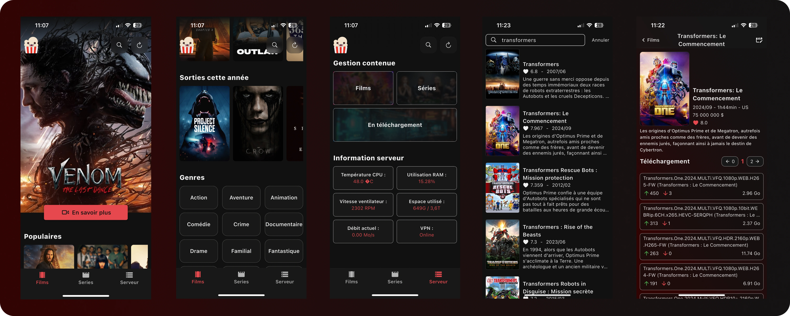

# HomeFlix

Suite à l'augmentation exagérée des tarifs ainsi qu'à l'apparition de publicités sur les différentes plateformes de streaming, je me suis mis en tête de créer un système permettant de facilement télécharger des torrents sur un serveur distant piloté par API. L'idée est donc ici de proposer une interface intuitive et conviviale au torrenting pour le rendre accessible à quiconque le souhaite. Vous retrouverez ici une application pour mobile et une API pour serveur Linux, qui bien entendu s'amélioreront au fil du temps. Évidemment, ce système a été conçu dans l'unique but de m'exercer et ne doit être utilisé que sur des œuvres dont on a le droit d’usage privé. Je ne pourrai donc être tenu d'aucune manière responsable de l'utilisation qui en sera faite ;).

## Installation et mise en route

### Serveur et API

- Il vous faudra installer Linux sur une machine.

- Paramétrer un partage FTP (idéalement SFTP) pour l'accès distant aux films et séries.

- Installer qbittorrent.

- Activer l'interface WEBAPI de qbittorrent dans les paramètres (Web user interface ...) et cocher 'bypass authentication for clients on localhost'.

- Ouvrir le port 4000 avec 'ufw allow 4000' sur votre machine.

- (Optionnel) ouvrir les ports 4000, 20 et 21 sur votre box pour que le serveur fonctionne en dehors de votre réseau.

- Copiez le fichier API dans votre home
  
- Créer un fichier contentData.json à la racine de l'api

- écrivez : {"tv" : {}, "movie": {}, "queue":{}} dans le fichier contentData.json

- Créer un fichier .env à la racine du dossier API.

- Ajouter [API_KEY="ce que vous voulez"] à votre .env.

- Ajouter [TORRENT_FOLDER="le chemin d'accès de vos fichier .torrent"] à votre .env

- 1jouter [CONTENT_FOLDER="le chemin d'accès de vos films et serie"] à votre .env

### (optionnel mais fortement recommandé) VPN

- Installer votre VPN favori avec un fichier de configuration openVPN (car celui-ci ne réécrit pas systématiquement les priorités des interfaces réseaux).

- Modifier la priorité des interfaces réseaux pour qu'elle soit donnée à votre connexion standard et en seconde position au VPN : 'sudo ip route del default via 192.168.1.1 dev enp2s0f0 proto dhcp src ... ' puis 'sudo ip route add default via 192.168.1.1 dev enp2s0f0 proto dhcp src ... metric 20 (ou inférieur à celui de tun0)'.

- Enfin, allez dans qbittorrent et dans les paramètres avancés, sélectionnez tun0 dans Network interface.

### App mobile

- Vous devrez ajouter un fichier .env à la racine du dossier de l'application.

- Ajouter votre pass_key ygg.re (YGG_PASSKEY=...).

- Ajouter votre clé API https://themoviedb.org/ (TMDB_KEY=...).

- Ajouter la clé API du serveur (NIGHTCENTER_KEY=...) (celle que vous avez choisie précédemment).
  
- Ajouter l'ip du serveur (NIGHTCENTER_IP=...) (votre ip public en cas d'ouverture ou privé sur votre réseau local)

- Enfin il ne vous reste plus qu'à build l'application pour l'os souhaité (il vous faudra une licence payante pour iOS).

### En cas de besoin ou de suggestion

Vous pouvez trouver de quoi me contacter sur mon site internet (il est joint à ce GitHub). Et oui je concède avoir emprunter l'icon de popcorn time par manque d'inspiration.
