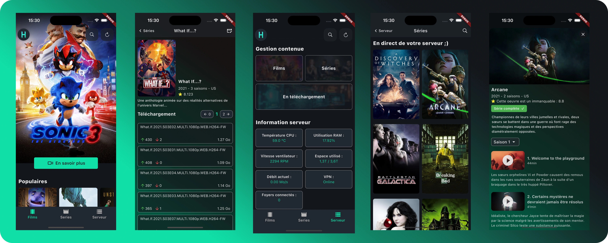

# HomeFlix

Dans le but d’élargir mes compétences, j’ai développé HomeFlix, une application complète permettant de télécharger et de visionner du contenu vidéo (films, séries, documentaires) à partir d’une source distante. L’objectif est d’offrir une expérience utilisateur fluide, moderne et intuitive.

## Architecture du système

### Le système est divisé en trois parties distinctes :

(A) L’application mobile
Une application cross-platform développée avec Flutter. Elle permet d’accéder à toute la bibliothèque disponible sur la source, d’effectuer des téléchargements et de visionner les contenus, que ce soit en ligne ou hors ligne.

(B) L’API serveur
Développée avec Node.js / Express, elle communique avec l’application pour :
- Gérer les téléchargements,
- Organiser la bibliothèque de contenu,
- Transmettre le flux vidéo en streaming,
- Fournir des informations sur l’état du serveur.

(C) L’API source
Cette API est conçue pour récupérer et formater les informations issues de la source distante avant de les transmettre aux autres composants du système. Étant adaptable à différentes sources de contenu, elle n’est pas fournie dans ce projet, laissant ainsi chacun libre de l’implémenter selon ses besoins.

⚠️ Responsabilité : Ce projet est fourni à des fins éducatives et son utilisation doit respecter les lois en vigueur. Je décline toute responsabilité quant à l’usage qui en est fait.

## APIs et technologies utilisées

### APIs mobilisées :
- TMDB API : pour obtenir les informations sur les films et séries,
- API source : à implémenter selon la source choisie,
- API serveur (B) : gestion des téléchargements et du streaming,
- API intermédiaire (C) : traitement et mise en forme des données provenant de la source.

### Technologies principales :
- Flutter : développement de l’application mobile,
- Node.js / Express : gestion du backend et des requêtes API.
	
## Installation et mise en route (version avec auth)

Concrètement, cette version s’installe de manière similaire à la version classique. Cependant, il est nécessaire de créer un compte Firebase, d’y ajouter les utilisateurs manuellement, puis d’intégrer les fichiers de configuration Firebase dans l’API.

Le système étant relativement complexe à expliquer — et le deviendra encore davantage avec le temps —, je vous recommande d’opter pour la version simple. Cela évitera également toute dérive, comme la commercialisation d’un service illégal.
